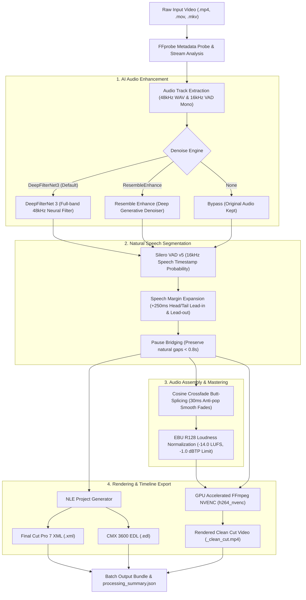

# Interview AI Studio: Natural Silence Remover and Neural Audio Denoiser

[](https://colab.research.google.com/github/RinmeSTD/DNColab/blob/main/Interview_AI_Studio.ipynb)
[](Interview_AI_Studio_Kaggle.ipynb)
[](https://www.python.org/)
[](https://pytorch.org/)
[](LICENSE)

**Interview AI Studio** is an automated, batch-processing video post-production tool designed for interviews, podcasts, webinars, and talking-head recordings. It eliminates dead air and pauses **naturally** without clipping speech boundaries, removes background noise using neural speech enhancement, normalizes broadcast loudness, renders at high speeds via NVIDIA NVENC GPU acceleration, and exports **Final Cut Pro 7 XML** and **CMX 3600 EDL** timelines for seamless NLE editing in **Adobe Premiere Pro** and **DaVinci Resolve**.

---

## Pipeline Architecture



---

## Repository Structure

```
DNColab/
|-- interview_studio/                 # Modular Python engine package
|   |-- __init__.py                   # Package exports and version info
|   |-- vad_engine.py                 # Silero VAD v5 speech segmentation & pause bridging
|   |-- denoise_engine.py             # DeepFilterNet 3 / Resemble & EBU R128 audio engine
|   |-- timeline_exporter.py          # Final Cut Pro 7 XML & CMX 3600 EDL generators
|   |-- video_engine.py               # FFprobe metadata & NVENC / CPU video cutting
|   `-- processor.py                  # Batch pipeline orchestrator & error isolation
|-- notebooks/                        # Jupyter / Colab / Kaggle cloud notebooks
|   |-- Interview_AI_Studio.ipynb         # Google Colab 1-click cloud studio
|   `-- Interview_AI_Studio_Kaggle.ipynb  # Kaggle interactive widgets studio
|-- tests/                            # Comprehensive automated test suite (70 tests)
|-- docs/                             # Architecture designs and implementation specs
|-- Interview_AI_Studio.ipynb         # Root Colab notebook (direct badge link)
|-- Interview_AI_Studio_Kaggle.ipynb  # Root Kaggle notebook
|-- interview_processor.py            # Root CLI launcher
|-- vad_engine.py                     # Root compatibility wrapper
|-- denoise_engine.py                 # Root compatibility wrapper
|-- timeline_exporter.py              # Root compatibility wrapper
|-- video_engine.py                   # Root compatibility wrapper
|-- run.ps1                           # 1-Click Windows PowerShell launcher
|-- run.sh                            # 1-Click Linux / macOS Bash launcher
|-- requirements.txt                  # Python dependencies
|-- LICENSE                           # MIT License
`-- README.md                         # Documentation
```

---

## Quickstart Guide

### Option 1: Run in Google Colab (1-Click, Free GPU)

Click the button below to launch the interactive studio directly in Google Colab:

[](https://colab.research.google.com/github/RinmeSTD/DNColab/blob/main/Interview_AI_Studio.ipynb)

#### Colab Workflow:
1. Open the notebook via the badge above.
2. In the Colab menu, verify a GPU runtime is selected (**Runtime** -> **Change runtime type** -> **T4 GPU**).
3. Run **Step 1** to install dependencies (with automatic Rust toolchain setup) and verify the GPU.
4. Run **Step 2** to mount Google Drive and configure input/output folders.
5. Place your raw video files in `/content/drive/MyDrive/Interview_Studio/input` (or `./inputs`).
6. Adjust parameter sliders in **Step 3** and run **Step 4 (Run Batch Queue)**.
7. Preview the processed cut video in the embedded player and download the `.zip` archive in **Step 5**.

---

### Option 2: Run in Kaggle (GPU P100 / T4 x2)

Use the dedicated Kaggle notebook: [`Interview_AI_Studio_Kaggle.ipynb`](Interview_AI_Studio_Kaggle.ipynb) (or [`notebooks/Interview_AI_Studio_Kaggle.ipynb`](notebooks/Interview_AI_Studio_Kaggle.ipynb))

#### Kaggle Workflow:
1. Upload `Interview_AI_Studio_Kaggle.ipynb` to Kaggle (**New Notebook** -> **File** -> **Import Notebook**).
2. In the right settings panel:
   - **Accelerator**: Select **GPU P100** or **GPU T4 x2**.
   - **Internet**: Switch to **Internet On**.
3. (Optional) Attach a Kaggle Dataset containing your raw interview videos. The notebook will auto-detect input videos in `/kaggle/input/`.
4. Run **Step 1** to install dependencies.
5. Run **Step 2** to discover dataset paths or initialize `/kaggle/working/inputs`.
6. Configure settings using the interactive `ipywidgets` GUI dashboard in **Step 3**.
7. Run **Step 4** to execute batch rendering.
88. In **Step 5**, all output cut videos, XMLs, and EDLs are packaged into `Interview_AI_Studio_Outputs.zip` and appear in the Kaggle **Output** sidebar tab for instant download.

---

### Option 3: Local Execution with 1-Click Launchers (PowerShell & Bash)

#### Prerequisites
- **Python**: 3.10 or higher
- **FFmpeg and FFprobe**: Installed and available in your system `PATH` ([Download FFmpeg](https://ffmpeg.org/download.html))
- **GPU (Optional)**: NVIDIA GPU with CUDA for NVENC acceleration (gracefully falls back to CPU `libx264` if unavailable)

#### 1-Click Launchers

The repository includes smart all-in-one launcher scripts that automatically create a virtual environment (`.venv`), install all requirements via `uv` or `pip`, create default input/output directories, and process all videos:

**Windows (PowerShell):**
```powershell
# Run with default folders (processes ./inputs/ into ./outputs/)
.\run.ps1

# Or pass custom arguments directly
.\run.ps1 --input D:\RawVideos --output D:\CleanVideos --min-silence 0.5 --padding 0.2
```

**Linux / macOS / WSL (Bash):**
```bash
# Make script executable
chmod +x run.sh

# Run with default folders (processes ./inputs/ into ./outputs/)
./run.sh

# Or pass custom arguments directly
./run.sh --input /path/to/raw --output /path/to/clean --min-silence 0.8
```

---

### Option 4: Manual Local CLI Execution

```bash
# 1. Clone the repository
git clone https://github.com/RinmeSTD/DNColab.git
cd DNColab

# 2. Create and activate a virtual environment
python -m venv venv
# Windows: .\venv\Scripts\Activate.ps1 | Linux/macOS: source venv/bin/activate

# 3. Install required dependencies
pip install -r requirements.txt

# 4. Run batch processor
python interview_processor.py --input ./inputs --output ./outputs
```

#### CLI Command Examples

**Podcast / Faster Paced Cuts (Shorter silence threshold and tighter padding):**
```bash
python interview_processor.py \
  --input ./podcast_raw \
  --output ./podcast_clean \
  --min-silence 0.5 \
  --padding 0.15 \
  --crossfade-ms 25
```

**Lectures / Formal Interviews (Keep natural thinking pauses):**
```bash
python interview_processor.py \
  --input ./lectures \
  --output ./lectures_cut \
  --min-silence 1.2 \
  --padding 0.30
```

**Silence Removal Only (Skip AI speech denoising):**
```bash
python interview_processor.py \
  --input ./raw_videos \
  --output ./cut_videos \
  --denoise-engine None
```

**CPU-Only Mode (Disable GPU acceleration):**
```bash
python interview_processor.py \
  --input ./raw_videos \
  --output ./cut_videos \
  --cpu
```

---

## NLE Timeline Integration Tutorial

Alongside the rendered `.mp4` video, Interview AI Studio automatically exports:
- `[video_name]_timeline.xml`: **Final Cut Pro 7 XML** sequence.
- `[video_name]_timeline.edl`: **CMX 3600 EDL** edit decision list.

These timeline files allow video editors to import the cuts directly into non-linear editing (NLE) software, keeping all original media handles accessible.

### 1. Adobe Premiere Pro Import

1. **Import the XML Sequence**:
   - Open your project in Adobe Premiere Pro.
   - Go to **File** -> **Import...** (or press `Ctrl+I` / `Cmd+I`).
   - Select the generated `[video_name]_timeline.xml` file.
2. **Media Relinking (If prompted)**:
   - Premiere Pro will import a sequence called `Interview_Cut` and the linked source media item.
   - If a "Link Media" dialog appears, point Premiere to the original raw video file.
3. **Open Timeline**:
   - Double-click the imported sequence. You will see every speech segment as an individual cut clip properly placed on Video Track 1 and Audio Tracks 1 and 2.

### 2. DaVinci Resolve Import

1. **Import Timeline**:
   - Open your project in DaVinci Resolve.
   - In the top menu bar, select **File** -> **Import Timeline** -> **Import AAF/EDL/XML...** (or press `Ctrl+Shift+I` / `Cmd+Shift+I`).
   - Select the `[video_name]_timeline.xml` (or `[video_name]_timeline.edl`).
2. **Timeline Settings**:
   - In the "Load XML..." options dialog, verify the timeline framerate matches your source video framerate (e.g. 23.976, 25, 29.97, or 30 fps).
   - Check **Automatically import source clips into media pool**.
   - Click **OK**.
3. **Review Cuts**:
   - DaVinci Resolve creates a new sequence populated with all speech segments butt-spliced on the Edit page.

---

### 3. Expanding and Contracting Cuts with Timeline Handles

Because Interview AI Studio builds non-destructive timelines pointing to the **original master media file**:
- **Full Handles Available**: The source media behind each cut point is completely preserved.
- **Expanding a Cut (Adding Lead-in/Lead-out)**:
   - In Premiere Pro or DaVinci Resolve, select the **Selection Tool** (`V`) or **Ripple Edit Tool** (`B`).
   - Click and drag the head or tail of any clip to extend it earlier or later. You have access to every frame of the original recording.
- **Rolling Edits**:
   - Use the **Rolling Edit Tool** (`N`) to adjust the cut point between two speech segments simultaneously without altering the overall timeline duration.
- **Slip Tool**:
   - Use the **Slip Tool** (`Y`) to shift the content of a speech segment earlier or later within its timeline boundary.

---

## Configuration Parameters Reference

| CLI Option | Colab / Kaggle Form Parameter | Default | Allowed Values / Range | Description |
| :--- | :--- | :--- | :--- | :--- |
| `--input`, `-i` | `INPUT_DIR` | *Required* | Path string | Directory containing raw input video files (`.mp4`, `.mov`, `.mkv`, `.avi`, `.webm`, `.m4v`). |
| `--output`, `-o` | `OUTPUT_DIR` | *Required* | Path string | Directory where cut videos, XML/EDL files, and summary logs will be saved. |
| `--denoise-engine` | `DENOISE_ENGINE` | `"DeepFilterNet3"` | `"DeepFilterNet3"`, `"ResembleEnhance"`, `"None"` | AI speech noise suppression model. `DeepFilterNet3` offers real-time full-band filtering; `ResembleEnhance` provides deep generative upsampling; `None` keeps original audio. |
| `--min-silence` | `MIN_SILENCE_SEC` | `0.8` | `0.2` - `2.0` (seconds) | Minimum duration of silence to remove. Pauses shorter than this duration are preserved to maintain natural speech flow. |
| `--padding` | `PADDING_SEC` | `0.25` (250ms) | `0.05` - `0.50` (seconds) | Head and tail margin added to each speech segment. Protects soft consonants, word onsets, and trailing breaths from being cut off. |
| `--crossfade-ms` | `CROSSFADE_MS` | `30` | `10` - `100` (ms) | Duration of smooth cosine crossfade applied between consecutive audio segments to prevent clicks and DC offset pops. |
| `--no-norm` | `NORMALIZE_AUDIO` | `True` (active) | Flag / Boolean (`True`/`False`) | Normalizes audio loudness to the EBU R128 broadcast standard (`-14.0 LUFS`, `-1.0 dBTP` true-peak ceiling). |
| `--no-xml` | `EXPORT_TIMELINE` | `True` (active) | Flag / Boolean (`True`/`False`) | Generates Final Cut Pro 7 XML (`.xml`) and CMX 3600 EDL (`.edl`) timeline project files for NLE import. |
| `--cpu` | `USE_GPU` | `True` (GPU) | Flag / Boolean (`True`/`False`) | Controls hardware acceleration. If GPU (`h264_nvenc`) is unavailable, automatically falls back to CPU (`libx264`). |
| `--overwrite` | `OVERWRITE` | `False` | Flag / Boolean (`True`/`False`) | If `False`, skips processing files that have already been rendered in the output folder. If `True`, reprocesses and overwrites. |

---

## Summary Metrics and Logging

Every batch execution writes a comprehensive JSON log to `{OUTPUT_DIR}/processing_summary.json`:
```json
[
  {
    "status": "success",
    "file": "/path/to/interview_01.mp4",
    "output_video": "/path/to/interview_01_clean_cut.mp4",
    "timelines": {
      "xml": "/path/to/interview_01_timeline.xml",
      "edl": "/path/to/interview_01_timeline.edl"
    },
    "stats": {
      "original_duration": 124.50,
      "kept_duration": 87.20,
      "silence_removed": 37.30,
      "silence_percentage": 29.96
    },
    "processing_time_sec": 8.42
  }
]
```

---

## Contributing and License

Contributions are welcome! Please feel free to submit pull requests or open issues for feature requests.
Licensed under the [MIT License](LICENSE).
